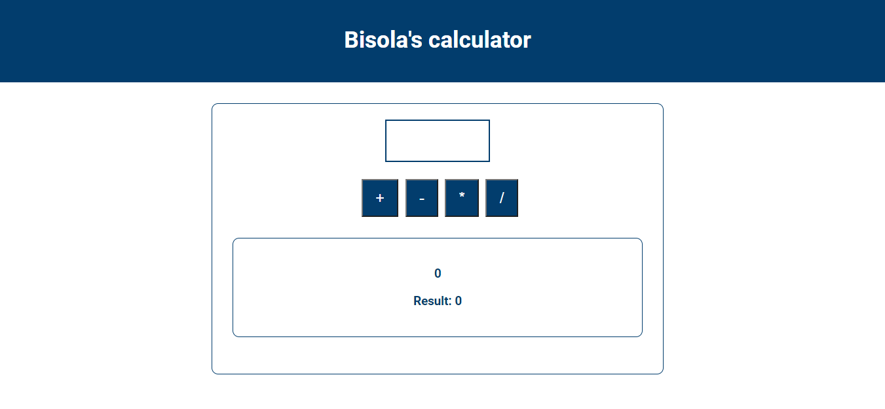

# The Unconventional Calculator

## General info
An awesome App that does your basic calculations!

## Screenshot

## Technologies
* HTML5
* CSS3
* Javascript

## Usage
Download project and start index.html file

## Contributing
Pull requests are welcome

## Inspiration
This app is based on Maximilian Schwarzmüller's course on complete JS!

## Contact
Created by [@daazzlinbib](https://twitter.com/Daazzlinbib) - feel free to contact me!
